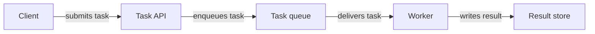

# Presentation examples

All cases are illustrative fixtures, not observed project results or host acceptance.
Use the [companion contract](../SKILL.md) and [shared writing policy](../../vl-adhd/SKILL.md).
These are source facts and expected behavior for semantic review. No renderer, live
interaction or keyboard result is claimed by this file.

## Architecture flow

Task: explain how a task reaches storage. No explicit format preference. Source:
[illustrative task-flow spec](https://example.invalid/specs/task-flow).
Automatically select an editable diagram and a complete text equivalent.

Source nodes:

| ID | Label |
| --- | --- |
| client | Client |
| api | Task API |
| queue | Task queue |
| worker | Worker |
| store | Result store |

Source edges (the full supplied topology):

| From | To | Meaning |
| --- | --- | --- |
| client | api | submits task |
| api | queue | enqueues task |
| queue | worker | delivers task |
| worker | store | writes result |

Editable diagram source:



Text equivalent: the Client submits a task to the Task API. The Task API enqueues
the task in the Task queue. The Task queue delivers it to the Worker. The Worker
writes the result to the Result store. No ordering, retry, security or exactly-once
guarantee is supplied. Do not add a client-to-store or API-to-store arrow.

Expected checks: compare all five nodes and four arrows with the source tables;
verify labels and direction, preserve the editable source and text. If the viewer
cannot render Mermaid, give this source and explanation and label rendering
unverified. Source accuracy does not prove a particular viewer rendered it.

## Short status

Source facts: issue #742 is docs-only, its PR number is not supplied, separate review
is pending, no merge authorization exists and usage is unavailable.
Expected choice: prose, without an artifact or clarification.

Issue #742’s PR needs separate review. It changes documentation only. The PR number
is not supplied. There is no merge authorization. Usage is unavailable, not zero.

## Fixed comparison

Task: compare two supplied options without adjustable inputs. Automatically use a
table. Source: [illustrative delivery decision](https://example.invalid/specs/delivery).

| Option | Supplied cost | Supplied uncertainty | Decision boundary |
| --- | --- | --- | --- |
| Batch processing | One scheduled job and delayed results | Peak completion time is unmeasured | Operator decision pending |
| Streaming | Continuous workers and ongoing operations | Retry load is unmeasured | Operator decision pending |

Expected checks: preserve both costs and unknowns. Do not invent prices, latency,
measurements or an approved choice. Static comparable attributes need no interaction.

## Scenario exploration

Task: understand how worker count changes available capacity. A changed input
materially improves understanding, so select an interactive view if a usable
capability exists. Source: [illustrative capacity model](https://example.invalid/specs/capacity).

Source assumptions: demand is 400 jobs/hour. Capacity per worker is 200 jobs/hour.
Worker count is an integer from 1 to 3. Demand and per-worker capacity remain fixed.
No retry, startup delay, variance, scaling cost or service guarantee is modeled.

Derived rules:

```text
total capacity = workers * 200 jobs/hour
load ratio = 400 / total capacity * 100 percent
backlog growth = max(0, 400 - total capacity) jobs/hour
```

Initial state: 2 workers. A native select named “Worker count” offers 1, 2 and 3.
Show all three named results and assumptions before any input change. The input
changes presentation-only calculations, not a product setting or an issue decision.

| Workers | Capacity (jobs/hour) | Load ratio (percent) | Backlog growth (jobs/hour) |
| --- | --- | --- | --- |
| 1 | 200 | 200 | 200 |
| 2 | 400 | 100 | 0 |
| 3 | 600 | 66.67 | 0 |

Expected primary interaction: change from 2 to 1 worker. Capacity changes from 400
to 200 jobs/hour, load ratio from 100 to 200 percent, and backlog growth from 0 to
200 jobs/hour. At 3 workers, round the displayed load ratio to 66.67 percent.
“Load ratio” is demand divided by modeled capacity; it is not measured CPU use.

Expected accessibility: reading order is source/assumptions, named input, named
results, then limits/evidence. Reach the native select using Tab, retain visible
focus, and change its option with the platform's keyboard controls. Results must
update and remain readable without color or hover. At narrow width, labels/results
wrap or stack. With reduced motion enabled, values and controls remain available;
no essential result depends on animation.

A provider must actually execute those checks before claiming interaction/keyboard
acceptance. This specification and arithmetic table do not establish a render path.
If no usable path exists, give the table and assumptions as the readable fallback.

## Explicit text-only override

Operator request: “Explain the task flow in text only.” Honor it even if a diagram
or interactive capability is available. Use the architecture text equivalent above,
including the absence of ordering/retry/security/exactly-once guarantees and the
source link. No visual dependency or capability question is needed.

## Material clarification

Source facts: the operator wants an interactive capacity explanation for teammates,
but the delivery surface is unspecified. Teammates may need a portable file, or may
work in the current chat; neither is stated. This changes usability and maintenance.
Ask: “Will teammates use the explanation in this chat, or need a portable file?”

That is one material delivery question, not a new publication approval rule.
Do not ask which routine chart style to use. Do not publish, install a renderer or
launch a server while waiting. After the answer, use the applicable existing
capability contract or explain its exact limitation and give a useful fallback.

## Unsupported or unverified path

Illustrative observed limitation: a selected provider requires SDK X, and the host's
exposed contract says SDK X is unavailable. Report that specific provider path as
unsupported. Give the scenario's initial and changed cases in the table above with
its assumptions and source link. Do not say that the host cannot render any visual.

Different evidence: source files exist, but no inline viewer or keyboard inspection
has been exercised. Report rendering/interaction/keyboard as unverified, not as a
measured unsupported capability. Keep editable architecture source and complete
text, or the scenario table. Source inspection is not runtime acceptance.

If the sandbox restricts visual links, put the source URL in adjacent prose. The
view does not replace the owning spec or create a second tracker. Document a required
export format that remains unmet instead of claiming the fallback completed it.

## Accessibility verification record

Expected checks, to be recorded with actual results on the owning issue:

| Check | Required observation | Limit if not exercised |
| --- | --- | --- |
| Reading order | Source, control, named results and evidence make sense in order | Source-only review does not establish screen-reader order |
| Named native control and focus | “Worker count” select has an accessible name and visible focus | Mark actual focus/name inspection unverified |
| Keyboard input | Tab reaches select; platform option change updates derived results | Mark keyboard operation unverified |
| Hover/color independence | Every result is visible and labeled without hover or color distinction | Static source alone is not browser inspection |
| Narrow width | Labels and values remain readable with wrapping/reflow | Record tested width, or narrow-width check unverified |
| Reduced motion | Motion-disabled view retains inputs, values and essential facts | Record actual preference/behavior, or unverified |

Review the routing and meaning separately from metadata/link/packaging tests. A
checklist or illustrative record must never be reported as a passed runtime check.
